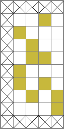
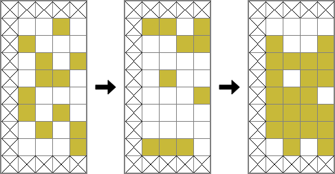
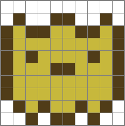

# Zadanie: Proceduralny Pixel Art

## O zadaniu

Poziom trudności: średni.
Uczy: algorytmy.

Pomysł algorytmu, jak również przykładowe obrazki zostały pierwotnie oblikowane [tutaj](https://github.com/yurkth/sprator#theory).

## Opis zadania

Twoim zadaniem jest napisanie programu, który wygeneruje kolorowe obrazki w stylu Pixel Art z wykorzystaniem bardzo prostego automatu komórkowego.

### _(opcjonalne)_ Czym jest automat komórkowy

Wyjaśnię, czym jest automat komórkowy za pomocą prostego przykładu. Zacznijmy od zwykłej, dwuwymiarowej tablicy liczb o rozmiarze 3x3:

```
+---+---+---+
| 0 | 1 | 0 |
| 0 | 1 | 0 |
| 0 | 0 | 1 |
+---+---+---+
```

Tablicę te nazywamy **siatką komórek**! Każda **komórka** ma określony **stan**. W moim przykładzie stan reprezentowany jest przez liczbę (ale nic nie stoi na przeszkodzie, aby użyć innego typu danych!) i ma dwie możliwe wartości: `1` oraz `0`, które oznaczają odpowiednio _żywa komórka_ oraz _martwa komórka_. Dodatkowo każda komórka ma swoje **sąsiedztwo**, które można zdefiniować na wiele sposobów. Jednakże, najczęściej sąsiedztwem nazywamy listę przyległych, sąsiadujących komórek (najpopularniejsze są sąsiedztwa wyznaczane metodą [Moore-a](https://en.wikipedia.org/wiki/Moore_neighborhood) i [Von Neumann-a](https://en.wikipedia.org/wiki/Von_Neumann_neighborhood)).

Każdy automat komórkowy ma **zbiór reguł**. **Regułą** nazywamy funkcje, która określa następny stan komórki, bazując na jej obecnym stanie oraz stanach komórek z jej sąsiedztwa. I tyle! Twój algorytm po prostu przegląda wszystkie komórki i tworzy nową **generację** komórek przez określenie kolejnych stanów zgodnie ze zbiorem reguł. Początkowy stan automatu (mówimy o nim `t = 0`) utworzony jest poprzez przypisanie (ręcznie, automatycznie lub losowo) stanu do każdej komórki.

W moim przykładzie zbiór zasad jest bardzo prosty: _Jeżeli komórka ma co najmniej dwóch żywych sąsiadów (wg sąsiedztwa Moore-a), to będzie żywa. W innym przypadku umiera._

```
+---+---+---+   +---+---+---+   +---+---+---+
| 0 | 1 | 0 |   | 0 | 0 | 0 |   | 0 | 0 | 0 |
| 0 | 1 | 0 |   | 0 | 1 | 0 |   | 0 | 0 | 0 |
| 0 | 0 | 1 |   | 0 | 0 | 0 |   | 0 | 0 | 0 |
+---+---+---+   +---+---+---+   +---+---+---+
     t=0             t=1             t=2
```

W drugiej generacji tylko komórka znajdująca się na środku przeżywa. Inne komórki umarły, bo nie miały wystarczająco dużo przyjaciół wokół siebie. W kolejnym kroku czasowym wszystkie komórki są już martwe. To wszystko, co musisz wiedzieć o automatach komórkowych. Proste prawda? Zatem zapraszam do zadania!

### Jak ustawic środowisko oraz testy

#### Mam poetry

```shell
poetry install  # tworzenie środowiska
poetry run python test.py  # uruchomienie testów
```

#### Nie wiem co to poetry

```shell
python3 -m virtualenv venv -ppython3 # tworzenie środowiska
source venv/bin/activate  # aktywacja środowiska
pip install -r requirements.txt  # instalacja pakietów
pytest test.py # uruchomienie testów
python procedural_pixel_art # uruchomienie generowanie obrazkow - tworzy plik formatu ppm
```

Tutaj dowiesz się czegoś o [Poetry](https://python-poetry.org)

### Podpowiedź

Poza kartą wymagań nr 4 nie ma wymagania, aby wyświetlić w jakikolwiek sposób generowany automat komórkowy! Wykorzystaj ten czas, aby ulepszyć swoje testy!

### Karta wymagań 1

Załóżmy, że komórka może mieć tylko dwa stany: **żywa** lub **martwa**. Stwórz siatkę komórek o rozmiarze **5x10** i wygeneruj losowy szum (tj. wartości ze zbioru `{0,1}`) w środkowej, dosuniętej do prawej części podsiatki o wymiarze **4x8** (pozostaw z góry, dołu i prawa obrys o szerokości jednej komórki). _Dalej nie wiesz, o co chodzi?_ Spójrz na obrazek poniżej, biały i żółty kolor oznacza odpowiednio martwe i żywe komórki.



### Karta wymagań 2

Zaimplementuj funkcje, która utworzy kolejną generację komórek zgodnie z następującym zbiorem reguł:

- Nie zmieniaj komórek znajdujących się w obrysie, możesz je uznać za martwe.
- Każda żywa komórka z dwoma lub trzema żywymi sąsiadami przeżywa (wg sąsiedztwa Moore-a).
- Każda martwa komórka z co najwyżej jednym żywym sąsiadem staje się żywa.
- W każdym innym przypadku komórka umiera lub jest dalej martwa.

**Wykonaj funkcję dwukrotnie**. Sprawdź obrazek poniżej, aby zobaczyć, jaki jest oczekiwany wynik.



### Karta wymagań 3

Skopiuj i odwróć siatkę, by utworzyć kompletny obraz (tj. lustrzane odbicie, tak aby siatka miała wymiar 10x10). Dodaj obrys zgodnie z sąsiedztwem Von Neumann-a (na rysunku poniżej zaznaczyłem te komórki na brązowo).



W tym momencie masz w pełni funkcjonalny proces generowania obrazków w stylu Pixel Art. Jako ostatnie wymaganie (o ile masz czas) możesz wykonać kolejny krok.

### _(opcjonalna)_ Karta wymagań 4

W ostatnim kroku, zamień stany komórek na kolory i zapisz automat jako prawdziwy obraz!

## Wskazówki

Pisz prosto! Utwórz zbiór funkcji o pojedynczej odpowiedzialności (tj. funkcja odpowiada tylko za jedną rzecz) oraz wykorzystaj wbudowane typy danych (tablice i liczby dadzą radę!).

## Sugestie przypadków testowych

- Czy wylosowana na początku tablica ma właściwy wymiar?
- Czy wszystkie komórki należące do obrysu są martwe?
- Czy kolejny stan komórki jest wyliczany poprawnie?
- Czy funkcja odwracająca siatkę działa poprawnie?
- Czy dodany kontur jest prawidłowy?

---

# Procedural Pixel Art Kata

## About this Kata

Difficulty: pre-intermediate
Useful for teaching: algorithm

The original theory for this Kata, as well as exemplary images was posted [here](https://github.com/yurkth/sprator#theory).

## Problem Description

Your task is writing a program that generates colorful Pixel Art sprites using a cellular automaton (which is very simple).

### _(optional)_ What is a cellular automaton

I explain what a cellular automaton by an example is. Let's have a two-dimensional array of numbers (3x3):

```
+---+---+---+
| 0 | 1 | 0 |
| 0 | 1 | 0 |
| 0 | 0 | 1 |
+---+---+---+
```

We call it **a grid** of **cells**! Each **cell** has a **state**. I represent a state by a number (but in general, you can use any data type!), so cells in my example have two possible states: `1` and `0`. I refer to them as _alive_ and _dead_. Additionally, each cell has **a neighborhood**, which can be defined in many ways. Still, it's typically a list of adjacent cells ([Moore](https://en.wikipedia.org/wiki/Moore_neighborhood) and [Von Neumann](https://en.wikipedia.org/wiki/Von_Neumann_neighborhood) neighborhoods are the most popular).

Each cellular automaton has a **ruleset**. A **rule** is a function that determines the next state of a cell in terms of the current state of cell and states of cells in its neighborhood. That's it! Your algorithm just iterates over all cells and creates a new **generation** by determining cells' next states according to a ruleset. An initial state of a cellular automaton (we call it `t = 0`) is selected by assigning (by hand or randomly) a state for each cell.

The ruleset in my example is very simple: _If a cell has at least two alive neightbors (according to the Moore neighborhood), it will be alive. Otherwise, it will be dead._

```
+---+---+---+   +---+---+---+   +---+---+---+
| 0 | 1 | 0 |   | 0 | 0 | 0 |   | 0 | 0 | 0 |
| 0 | 1 | 0 |   | 0 | 1 | 0 |   | 0 | 0 | 0 |
| 0 | 0 | 1 |   | 0 | 0 | 0 |   | 0 | 0 | 0 |
+---+---+---+   +---+---+---+   +---+---+---+
     t=0             t=1             t=2
```

In my example's second generation, the only alive cell is that one in the center. This is because the other ones didn't have enough alive friends. In the next time step, all cells are dead (you know why? right?). That's all, Folks! You have now all theory to complete the Kata!

### Hint

Except the optional user story 4, there is **no requirement** for displaying a cellular automaton! Use your time for making your tests better!

### User Story 1

Let's assume that a cell has only two states: **live** and **dead**. Create **a 5x10 grid** and generate a random noise inside **the right-aligned 4x8 sub-grid** (left a one cell border, we'll use it later). _Still don't know what to do?_ See the below image, where white and yellow colors mean the dead and live states, respectively.


### User Story 2

Create _a function_ that changes the cell's states according to the following **ruleset**:

- Do not change border cells, but you can count them as dead.
- Any live cell with two or three neighbors survives (use the Moore neighborhood).
- Any dead cell with one or less live neighbors becomes a live cell.
- All other live cells die in the next generation. Similarly, all other dead cells stay dead.

**Run the function twice**. Check the below example to see how it works.


### User Story 3

Copy and flip grid to make a complete image (so the grid has a size of 10x10). Add an outline according to the Von Neumann  neighborhood (just add a new cell state, I marked it as the brown color).


At this point, you have a fully functional pixel art generation process. As the last step (if you have time), you can do the optional User Story 4.

### _(optional)_ User Story 4

The last step is changing cell states into real (like RGB) colors and saving it as an actual image!

## Clues

Keep it simple! Just create a set of single-responsible functions and use build-in data-types.

## Suggested Test Cases

- Does a random array has the right size?
- Are all border cells dead at the beginning?
- Does the function determine the next state correctly?
- Does the flip function do its job?
- Is the outline is ok?
